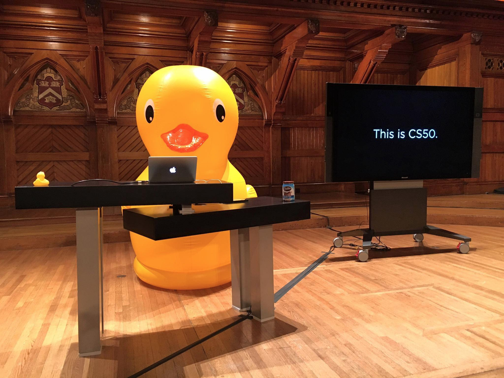

# CS50's Introduction to Computer Science

> Demanding, but definitely doable.
> Social, but educational.
> A focused topic, but broadly applicable skills.
> CS50 is the quintessential Harvard course.

## Instructor

[David J. Malan](https://cs.harvard.edu/malan/)  
[malan@harvard.edu](mailto:malan@harvard.edu)  

## Syllabus

Introduction to the intellectual enterprises of computer science and the art of programming. This course teaches students how to think algorithmically and solve problems 
efficiently. Topics include abstraction, algorithms, data structures, encapsulation, resource management, security, software engineering, and web programming. Languages include 
C, Python, and SQL plus HTML, CSS, and JavaScript. Problem sets inspired by the arts, humanities, social sciences, and sciences. Course culminates in a final project. Designed 
for concentrators and non-concentrators alike, with or without prior programming experience. Two thirds of CS50 students have never taken CS before. Among the overarching goals 
of this course are to inspire students to explore unfamiliar waters, without fear of failure, create an intensive, shared experience, accessible to all students, and build 
community among students.

## Expectations

You are expected to

• submit ten problem sets,  
• submit ten labs, and  
• submit a final project.

## Websites

* [CS50's Introduction to Computer Science - **Edx**](https://www.edx.org/course/cs50s-introduction-to-computer-science)
* [CS50's Introduction to Computer Science - **OpenCourseWare**](https://cs50.harvard.edu/x/2021/)

## Certificates

CS50x is free to take, and you are welcome to submit the course’s ten problem sets and final project for automated feedback. To be eligible for a 
[verified certificate](https://www.edx.org/verified-certificate) from edX, however, you must receive a satisfactory score (at least 70%) on each problem you submit as part of 
one of the course’s ten problem sets as well as on the course’s final project.

Problems are evaluated along axes of correctness (as determined by a program called `check50`) and style (as determined by a program called `style50`), with scores ordinarily 
computed as 3 × correctness + 1 × style.

## Books

No books are required or recommended for this course. However, you might find the below books of interest. Realize that free, if not superior, resources can be found on the 
course’s website.

*Hacker’s Delight*, Second Edition  
Henry S. Warren Jr.  
Pearson Education, 2013  
ISBN 0-321-84268-5

*How Computers Work*, Tenth Edition  
Ron White  
Que Publishing, 2014  
ISBN 0-7897-4984-X

*Programming in C*, Fourth Edition  
Stephen G. Kochan  
Pearson Education, 2015  
ISBN 0-321-77641-0

## Lectures

[Week 0](https://cs50.harvard.edu/x/2021/weeks/0/) Scratch  
[Week 1](https://cs50.harvard.edu/x/2021/weeks/1/) C  
[Week 2](https://cs50.harvard.edu/x/2021/weeks/2/) Arrays  
[Week 3](https://cs50.harvard.edu/x/2021/weeks/3/) Algorithms  
[Week 4](https://cs50.harvard.edu/x/2021/weeks/4/) Memory  
[Week 5](https://cs50.harvard.edu/x/2021/weeks/5/) Data Structures  
[Week 6](https://cs50.harvard.edu/x/2021/weeks/6/) Python  
[Week 7](https://cs50.harvard.edu/x/2021/weeks/7/) SQL  
[Week 8](https://cs50.harvard.edu/x/2021/weeks/8/) HTML, CSS, JavaScript  
[Week 9](https://cs50.harvard.edu/x/2021/weeks/9/) Flask  
[Week 10](https://cs50.harvard.edu/x/2021/weeks/10/) Ethics  

[Security](https://cs50.harvard.edu/x/2021/weeks/security/)  
[Artificial Intelligence](https://cs50.harvard.edu/x/2021/weeks/ai/)

## Problem Sets

**Week 0**  
&emsp;[Scratch](https://github.com/HawksSpawn/cs50-introduction-to-computer-science/tree/main/assignments/week_0/pset0#project) - 100%

**Week 1**  
&emsp;[Lab 1: Population Growth](assignments/week_1/lab_1/population/population.c) - 100%  
&emsp;[Hello](assignments/week_1/lab_1/hello/hello.c) - 100%  
&emsp;[Mario (Less)](assignments/week_1/pset1/mario/less/mario.c) - 100%  
&emsp;[Mario (More)](assignments/week_1/pset1/mario/more/mario.c) - 100%  
&emsp;[Cash](assignments/week_1/pset1/cash/cash.c) - 100%  
&emsp;[Credit](assignments/week_1/pset1/credit/credit.c) - 100%

**Week 2**  
&emsp;Lab 2: Scrabble  
&emsp;Readability  
&emsp;Caesar  
&emsp;Substitution

**Week 3**  
&emsp;Lab 3: Sort  
&emsp;Plurality  
&emsp;Runoff  
&emsp;Tideman

**Week 4**  
&emsp;Lab 4: Volume  
&emsp;Filter (Less)  
&emsp;Filter (More)  
&emsp;Recover

**Week 5**  
&emsp;Lab 5: Inheritance  
&emsp;Speller

**Week 6**  
&emsp;Lab 6: World Cup  
&emsp;Sentimental / Hello  
&emsp;Sentimental / Mario (Less)  
&emsp;Sentimental / Mario (More)  
&emsp;Sentimental / Cash  
&emsp;Sentimental / Credit  
&emsp;Sentimental / Readability  
&emsp;DNA

**Week 7**  
&emsp;Lab 7: Songs  
&emsp;Movies  
&emsp;Fiftyville

**Week 8**  
&emsp;Lab 8: Trivia  
&emsp;Homepage

**Week 9**  
&emsp;Lab 9: Birthdays  
&emsp;Finance

**Week 10**  
&emsp;Lab 10: Ethics

**Final Project**  
&emsp;Final Project

## Academic Honesty

This course’s philosophy on academic honesty is best stated as “be reasonable.” The course recognizes that interactions with classmates and others can facilitate mastery of the 
course’s material. However, there remains a line between enlisting the help of another and submitting the work of another. This policy characterizes both sides of that line.

The essence of all work that you submit to this course must be your own. Collaboration on problem sets is not permitted except to the extent that you may ask classmates and 
others for help so long as that help does not reduce to another doing your work for you. Generally speaking, when asking for help, you may show your code to others, but you may 
not view theirs, so long as you and they respect this policy’s other constraints. Collaboration on the course’s final project is permitted to the extent prescribed by its 
specification.

Below are rules of thumb that (inexhaustively) characterize acts that the course considers reasonable and not reasonable. If in doubt as to whether some act is reasonable, do 
not commit it. If the course determines that you have commited an act that is not reasonable, you may be deemed ineligible for a certificate. If you commit some act that is not 
reasonable but bring it to the attention of the course’s instructor within 72 hours, the course may reconsider that outcome.

### Reasonable

* Communicating with classmates about problem sets’ problems in English (or some other spoken language).
* Discussing the course’s material with others in order to understand it better.
* Helping a classmate identify a bug in his or her code in person or online, as by viewing, compiling, or running his or her code, even on your own computer.
* Incorporating a few lines of code that you find online or elsewhere into your own code, provided that those lines are not themselves solutions to assigned problems and that 
  you cite the lines’ origins.
* Sending or showing code that you’ve written to someone, possibly a classmate, so that he or she might help you identify and fix a bug.
* Sharing a few lines of your own code online so that others might help you identify and fix a bug.
* Turning to the web or elsewhere for instruction beyond the course’s own, for references, and for solutions to technical difficulties, but not for outright solutions to 
  problem set’s problems or your own final project.
* Whiteboarding solutions to problem sets with others using diagrams or pseudocode but not actual code.
* Working with (and even paying) a tutor to help you with the course, provided the tutor does not do your work for you.

### Not Reasonable

* Accessing a solution to some problem prior to (re-)submitting your own.
* Asking a classmate to see his or her solution to a problem set’s problem before (re-)submitting your own.
* Decompiling, deobfuscating, or disassembling the staff’s solutions to problem sets.
* Failing to cite (as with comments) the origins of code or techniques that you discover outside of the course’s own lessons and integrate into your own work, even while 
  respecting this policy’s other constraints.
* Giving or showing to a classmate a solution to a problem set’s problem when it is he or she, and not you, who is struggling to solve it.
* Paying or offering to pay an individual for work that you may submit as (part of) your own.
* Searching for or soliciting outright solutions to problem sets online or elsewhere.
* Splitting a problem set’s workload with another individual and combining your work.
* Submitting (after possibly modifying) the work of another individual beyond the few lines allowed herein.
* Submitting the same or similar work to this course that you have submitted or will submit to another.
* Viewing another’s solution to a problem set’s problem and basing your own solution on it.
